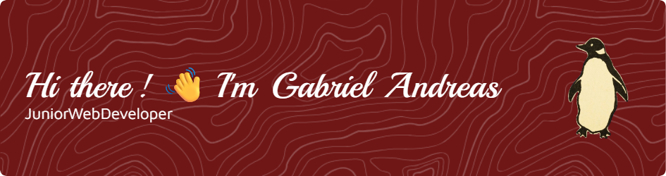

<!-- # Hi there! 👋 I'm Gabriel Andreas -->



<div align="center">
  
</div>

## 🚀 About Me

I'm a **Fresh Graduate** with a **Diploma in Information Technology** from **Brawijaya University**, specializing in **Digital Business & E-Commerce**. I'm passionate about creating efficient web solutions that bridge technology and business needs.

- 🎓 **Education:** D3 Information Technology - Brawijaya University
- 💼 **Experience:** Frontend Web Developer Intern
- 🌱 **Currently Learning:** Laravel Framework, Advanced JavaScript,  API Integration
- 💡 **Interests:** E-Commerce Development, Digital Marketing, Web Optimization
- 📍 **Location:** Jakarta, Indonesia

## 🛠️ Tech Stack

### Languages & Frameworks


### Tools & Technologies


## 🏆 Certifications & Achievements

### 📜 Professional Certifications

- **BNSP Junior Web Developer** - *Badan Nasional Sertifikasi Profesi*
- Certified competency in web development standards and best practices
- Demonstrates proficiency in frontend development and web technologies

### 🎖️ Internship Completion

- **Frontend Web Developer Internship Certificate**
- Successfully completed intensive hands-on training program
- Demonstrated practical skills in real-world project development

## 💼 Professional Experience

### 🏢 Frontend Web Developer Intern
**Pt. Pratama Link** • *5 Months | September 2024 - January 2025*

- 🔧 Developed responsive web interfaces using **Laravel** and **Bootstrap**
- 🔗 Integrated frontend applications with backend **APIs**
- 📊 Managed data flow from APIs to dynamic frontend displays
- 🤝 Collaborated with backend teams for performance optimization
- 📱 Ensured cross-browser compatibility and mobile responsiveness

## 🚀 Featured Projects

### 🏥 Hospital Information System
[](https://github.com/gabandreas/hospital-information-system)
[](http://182.253.200.171/)

**Tech Stack:** `Laravel` `Bootstrap` `JavaScript` `MySQL`

- 🏥 Comprehensive hospital management system with patient registration
- 👨‍⚕️ Doctor and staff management with role-based authentication
- 📋 Medical records management and appointment scheduling
- 💊 Pharmacy inventory tracking and prescription management
- 📊 Patient history tracking and medical report generation
- 📱 Responsive design for desktop and mobile access

### 🖨️ Digital Printing Product Landing Page
[](https://github.com/gabandreas/digital-printing-landing)
[](http://127.0.0.1:8005/)

**Tech Stack:** `HTML5` `CSS3` `Bootstrap` `JavaScript`

- 🎨 Modern, conversion-focused landing page design
- 🖼️ Interactive product gallery with image zoom functionality
- 📞 Lead generation forms with email integration
- ⚡ Optimized for fast loading and SEO performance
- 📱 Mobile-first responsive design approach
- 🎯 Call-to-action optimization for better conversion rates

### 📊 Business Analytics Dashboard
[](https://github.com/yourusername/analytics-dashboard)
[](http://127.0.0.1:8005/admin/dashboard)

**Tech Stack:** `Laravel` `Chart.js` `Bootstrap` `MySQL`

- 📈 Interactive business intelligence dashboard
- 🔄 Real-time API integration for live data updates
- 📊 Dynamic data visualizations and reporting features
- 💻 Responsive interface for multi-device accessibility

## 📊 GitHub Statistics

<div align="center">
  
  
</div>

<div align="center">
  
</div>

## 🌱 Currently Learning

```javascript
const currentlyLearning = {
    frontend: ['Vue.js', 'React.js', 'Advanced JavaScript'],
    backend: ['Laravel API Development', 'Node.js Basics'],
    design: ['UI/UX Principles', 'Figma'],
    business: ['Digital Marketing Analytics', 'SEO Optimization'],
    tools: ['Docker', 'AWS Basics']
};
```

## 🎯 2025 Goals

- [ ] 🚀 Contribute to **3+ open-source projects**
- [ ] 💻 Master **full-stack development** with modern frameworks
- [ ] 📜 Obtain **industry certifications** (AWS, Google Analytics)
- [ ] 🏆 Build **5+ complex portfolio projects**
- [ ] 🤝 Join **tech communities** and attend meetups
- [ ] 📚 Complete **advanced JavaScript** and **Vue.js** courses

## 💡 Core Competencies

<table>
  <tr>
    <td align="center" width="200px">
      <h3>🎨 Frontend Development</h3>
      <p>Responsive Design<br/>Cross-browser Compatibility<br/>UI/UX Implementation</p>
    </td>
    <td align="center" width="200px">
      <h3>🔗 API Integration</h3>
      <p>RESTful Services<br/>JSON Data Handling<br/>Authentication Systems</p>
    </td>
    <td align="center" width="200px">
      <h3>🛒 E-Commerce</h3>
      <p>Online Store Development<br/>Payment Integration<br/>Business Logic</p>
    </td>
  </tr>
  <tr>
    <td align="center" width="200px">
      <h3>⚡ Performance</h3>
      <p>Code Optimization<br/>Loading Speed<br/>SEO Best Practices</p>
    </td>
    <td align="center" width="200px">
      <h3>🔧 Problem Solving</h3>
      <p>Debugging & Testing<br/>Troubleshooting<br/>Solution Implementation</p>
    </td>
    <td align="center" width="200px">
      <h3>📈 Digital Business</h3>
      <p>E-Commerce Strategy<br/>Digital Marketing<br/>Analytics & Reporting</p>
    </td>
  </tr>
</table>

## 📫 Let's Connect!

<div align="center">
  
[](mailto:your.gabandreas32@gmail.com)
[](https://linkedin.com/in/gabriel-hutapea-b7a277374)
[](http://127.0.0.1:8007/)
[](https://instagram.com/gabandreas_)

</div>

---

<div align="center">
  <h3>💭 Quote</h3>
  <i>"Dedicated to creating innovative digital solutions that bridge technology and business excellence"</i>
</div>

---

<div align="center">
  
  
  [](https://github.com/gabandreas)
  
</div>

### 🏆 Professional Highlights

- ✅ **Strong Foundation:** Solid understanding of web development and digital business
- ✅ **Practical Experience:** Proven track record in API integration and frontend development  
- ✅ **Business Acumen:** Deep understanding of e-commerce ecosystem and digital marketing
- ✅ **Team Player:** Excellent collaboration and problem-solving skills
- ✅ **Growth Mindset:** Committed to continuous learning and professional development

---

<div align="center">
  <p><i>⭐️ From <a href="https://github.com/gabandreas">gabandreas</a></i></p>
  <p><i>Feel free to reach out for exciting projects, collaboration opportunities, or professional discussions! 🚀</i></p>
</div>

<div align="center">


### 🎯 Developer Jokes Zone
<details>
<summary>😄 Click for a random dev joke!</summary>

```javascript
const jokes = [
  "Why do programmers prefer dark mode? Because light attracts bugs! 🐛",
  "How many programmers does it take to change a light bulb? None, that's a hardware problem! 💡",
  "Why don't programmers like nature? It has too many bugs! 🌿🐛",
  "What's a programmer's favorite hangout place? Foo Bar! 🍻",
  "Why did the programmer quit his job? He didn't get arrays! 💰"
];

console.log(jokes[Math.floor(Math.random() * jokes.length)]);
// Refresh for another joke! 😄
```

</details>


### 🚀 Visitor Spaceship
```
    🛸
   /   \
  /_____\
     |
 You are visitor number:
```


### 🎲 Random Developer Quote Generator


---
### 🎶 My Taste Of Music


<br clear="both">


###

<picture>
  <source media="(prefers-color-scheme: dark)" srcset="https://raw.githubusercontent.com/gabandreas/gabandreas/output/pacman-contribution-graph-dark.svg">
  <source media="(prefers-color-scheme: light)" srcset="https://raw.githubusercontent.com/gabandreas/gabandreas/output/pacman-contribution-graph.svg">
  
</picture>

###